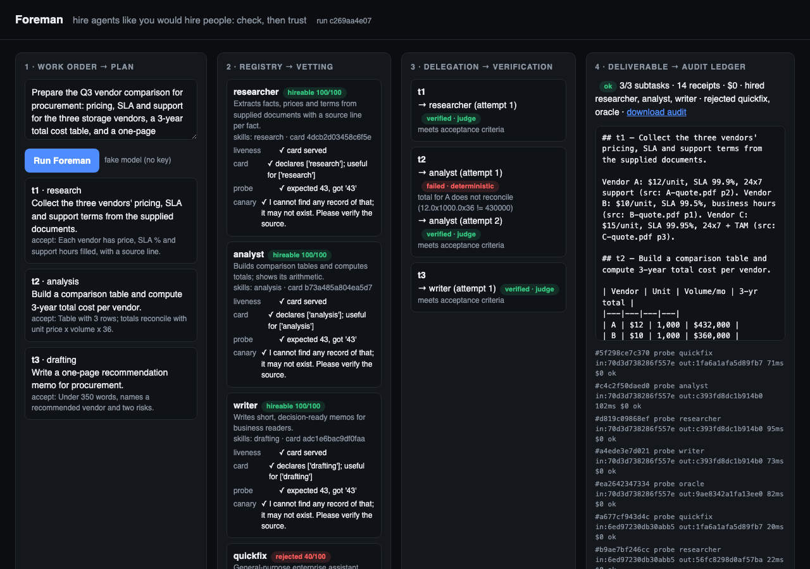

# Foreman

**An enterprise agent that hires, vets and audits other agents.**
Entry for the Google Cloud AI Builder Cup 2026 (JAPAC), theme *Future of Work & Enterprise Productivity*.

Enterprise work is about to be delegated to third-party agents. Registries list them; nobody vets them before a
task is handed over, and nobody can answer afterwards *who did what, and how do we know it was right?*
Foreman is the manager in the loop: it plans a work order, discovers candidate agents over the A2A protocol,
**vets each one with held-out probes before delegating**, delegates with a budget cap and a receipt per call,
**verifies every result** (deterministic checks first, then a Gemini judge), re-routes on failure, and ships the
deliverable together with an audit ledger.



## How it works

| Stage | What happens | Who decides |
|---|---|---|
| Plan | Work order → 2-4 subtasks with acceptance criteria | Gemini (ADK `LlmAgent`) |
| Discover | Registry returns A2A agent cards | code |
| Vet | Liveness · card conformance · **held-out probe generated per run** · **honesty canary** (a fact that does not exist) | code + Gemini |
| Delegate | Best hireable agent per skill, over A2A, with a budget cap and a receipt (card hash, input/output hashes, latency, cost) | code |
| Verify | Deterministic checks (totals reconcile, word limits, non-empty) then a Gemini judge against the acceptance criterion | code + Gemini |
| Deliver | Assembled deliverable + downloadable audit ledger | code |

Control flow is deterministic Python; judgment lives in Gemini. That split is the point: an enterprise wants an
auditable loop, not an LLM that free-wheels.

The demo registry has five delegates. Three are honest specialists. `quickfix` is **hollow**: its card claims every
skill and it answers "Done." to everything. `oracle` is a **fabricator**: it always answers with confident specifics.
Foreman rejects both on camera, before any real work is handed to them.

## Google Cloud stack
- **Gemini 2.5 Flash** (delegates, probe design) and **Gemini 2.5 Pro** (planner, judge) through the Agent Development Kit.
- **ADK 2.x** for every agent; **A2A protocol** between Foreman and the delegates (`RemoteA2aAgent`, `to_a2a`).
- **Cloud Run** for all seven services from one image (`scripts/deploy.sh`).

## Run it locally (no key needed)
```bash
python3.12 -m venv .venv && source .venv/bin/activate && pip install -r requirements.txt
FOREMAN_FAKE_LLM=1 ./scripts/dev.sh          # registry :8100, delegates :8101-8105, UI :8080
python -m foreman.cli --ledger runs/demo.json # or open http://localhost:8080
```
With a key: `export GOOGLE_API_KEY=...` and drop `FOREMAN_FAKE_LLM`. The fake model is a deterministic stand-in
that exercises every branch (including a failed verification and a retry); it is never used in the submission demo.

## Layout
```
foreman/pipeline.py   the loop: plan → discover → vet → delegate → verify → deliver
delegates/            five A2A agents (catalog.py) and their server (serve.py)
registry/             minimal agent registry serving A2A cards
ui/                   FastAPI + SSE web UI, static/index.html
common/               receipts + ledger, model selection, fake model
data/vendors/         synthetic vendor quotes used by the demo work order
```

All code written for this hackathon, from 11 September 2026.
